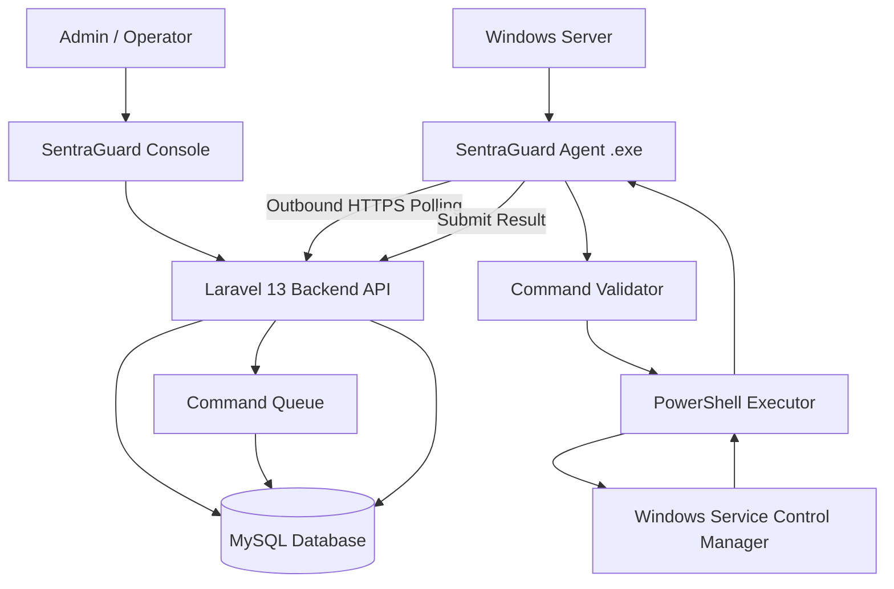
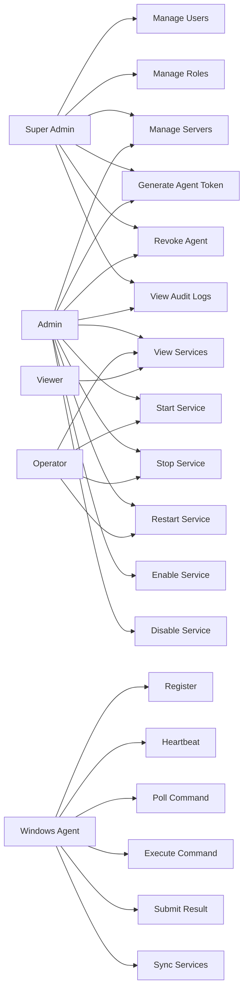
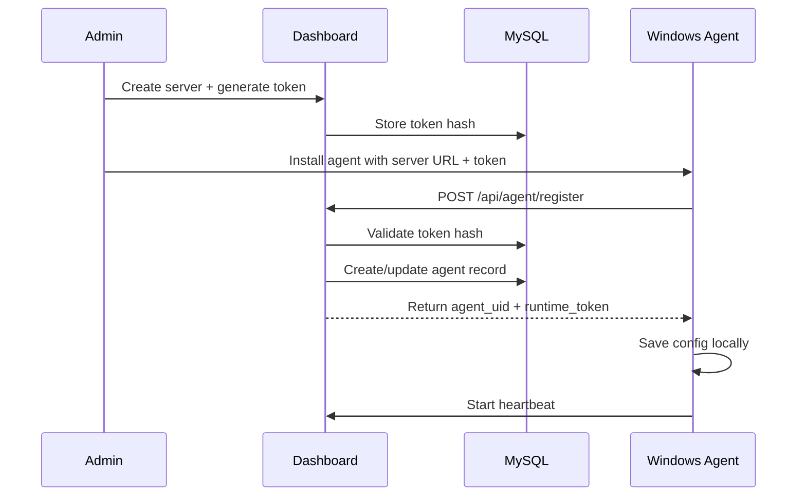
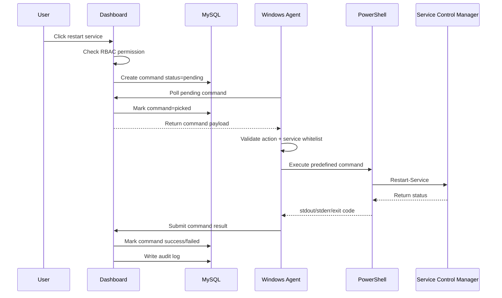
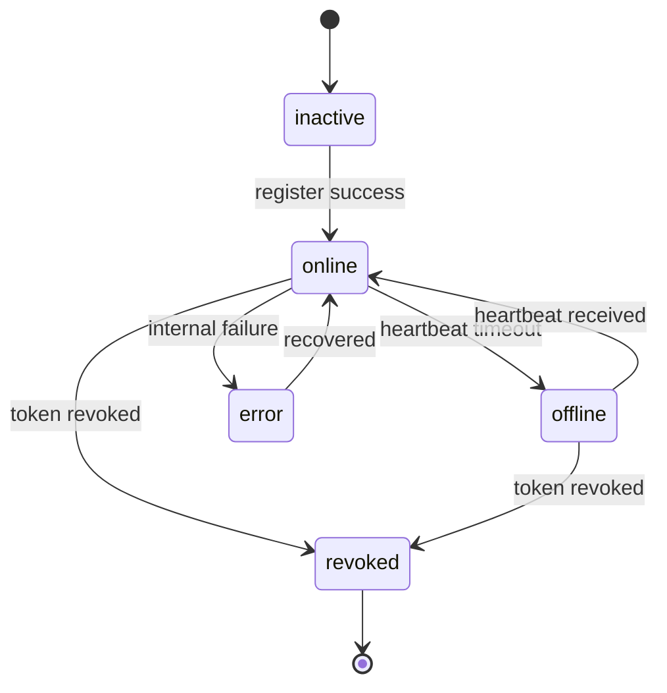
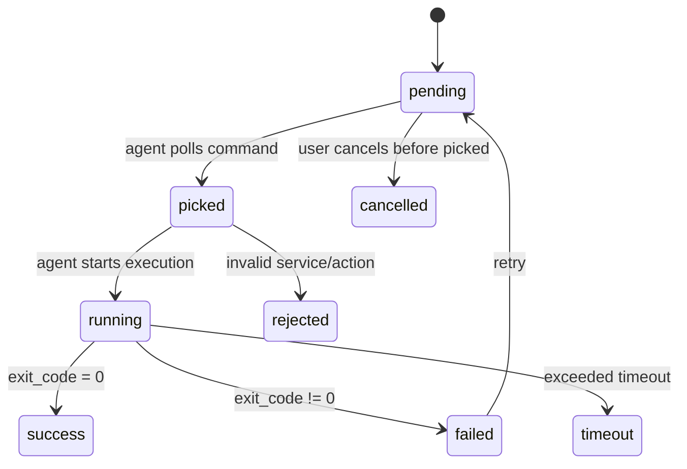
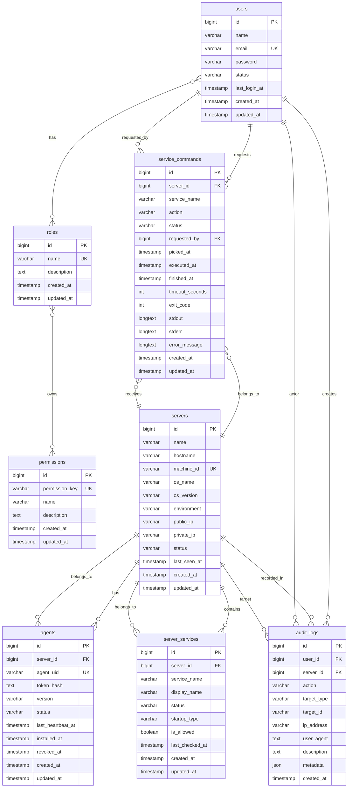

# SentraGuard AgentOps

> Centralized Windows Service Control Platform powered by Laravel 13, PHP 8.4, MySQL, and a Windows Agent `.exe`.


---

## Table of Contents

- [1. Project Overview](#1-project-overview)
- [2. Product Identity](#2-product-identity)
- [3. Background](#3-background)
- [4. Objectives](#4-objectives)
- [5. Architecture Overview](#5-architecture-overview)
- [6. Why Pull-Based Agent](#6-why-pull-based-agent)
- [7. Core Modules](#7-core-modules)
- [8. Feature Scope](#8-feature-scope)
- [9. Technology Stack](#9-technology-stack)
- [10. UML Use Case](#10-uml-use-case)
- [11. System Flow](#11-system-flow)
- [12. Database Design](#12-database-design)
- [13. MySQL Schema Draft](#13-mysql-schema-draft)
- [14. API Contract](#14-api-contract)
- [15. Windows Agent Specification](#15-windows-agent-specification)
- [16. Security Design](#16-security-design)
- [17. RBAC Matrix](#17-rbac-matrix)
- [18. UI Structure](#18-ui-structure)
- [19. Repository Structure](#19-repository-structure)
- [20. Environment Configuration](#20-environment-configuration)
- [21. Deployment Design](#21-deployment-design)
- [22. Development Roadmap](#22-development-roadmap)
- [23. MVP Acceptance Criteria](#23-mvp-acceptance-criteria)
- [24. Risk Register](#24-risk-register)
- [25. References](#25-references)

---

## 1. Project Overview

**SentraGuard AgentOps** is a centralized web platform for managing Windows Services across multiple Windows Server machines using a lightweight Windows Agent.

The platform allows authorized users to control selected Windows Services from a central dashboard without directly opening RDP or exposing custom inbound API ports on each Windows Server.

Supported service actions:

- Start service
- Stop service
- Restart service
- Enable service startup
- Disable service startup
- Sync service status
- Track command history
- Audit every administrative action

The Windows Agent is distributed as an `.exe` and installed as a **Windows Service**. After installation, the agent connects outbound to the central dashboard over HTTPS, polls for pending commands, executes approved service operations locally, and reports the result back to the dashboard.

---

## 2. Product Identity

| Item | Value |
|---|---|
| Project Name | `SentraGuard AgentOps` |
| Dashboard Name | `SentraGuard Console` |
| Windows Agent Name | `SentraGuard Agent` |
| Agent Binary | `sentraguard-agent.exe` |
| Installer Name | `SentraGuardAgentSetup.exe` |
| Windows Service Name | `SentraGuard Agent Service` |
| Architecture Pattern | Pull-Based Agent Architecture |
| Primary Backend | Laravel 13 |
| Runtime | PHP 8.4 |
| Database | MySQL |
| Agent Runtime | Go single-binary `.exe` |

---

## 3. Background

Managing Windows Services manually is operationally inefficient when an organization has multiple Windows Servers. Common manual approaches include:

- Remote Desktop Protocol access
- `services.msc`
- Manual PowerShell execution
- Direct login to each server
- Manual tracking of who changed what and when

This introduces several operational problems:

- Too much dependency on RDP access
- No centralized audit trail
- No centralized service status visibility
- Hard to safely delegate service control to operators
- Higher risk of accidental service disruption
- Slow incident response when services need to be restarted quickly

SentraGuard AgentOps is designed to solve these problems by introducing a controlled, auditable, and centralized Windows Service operation platform.

---

## 4. Objectives

### 4.1 Primary Objective

Build a centralized web dashboard that can safely manage selected Windows Services on multiple Windows Servers using a secure outbound Windows Agent.

### 4.2 Operational Objectives

- Reduce direct RDP usage for routine service operations.
- Provide centralized visibility of Windows Service status.
- Provide audit logs for every service action.
- Allow safe role-based delegation to operators.
- Prevent arbitrary PowerShell execution from the dashboard.
- Support multiple Windows Servers from a single dashboard.
- Keep the Windows side simple: install `.exe`, configure token, run service.

### 4.3 Security Objectives

- Do not expose custom inbound agent ports on Windows Servers.
- Use HTTPS for all dashboard-agent communication.
- Use hashed token storage on the backend.
- Restrict actions using service whitelist and RBAC.
- Make every administrative action traceable.

---

## 5. Architecture Overview

SentraGuard AgentOps uses a **pull-based agent model**.

The agent installed on Windows Server initiates communication to the central dashboard. The dashboard does not directly connect to the Windows Server.



### Main Data Flow

1. Admin creates a command from the dashboard.
2. Backend validates user permission.
3. Backend stores command as `pending` in MySQL.
4. Windows Agent polls the backend over HTTPS.
5. Agent receives pending command.
6. Agent validates command and service whitelist.
7. Agent executes a safe predefined PowerShell action.
8. Agent reports result back to the backend.
9. Dashboard displays command status and audit trail.

---

## 6. Why Pull-Based Agent

The project intentionally uses a pull-based agent model instead of exposing a public API on every Windows Server.

| Aspect | Pull-Based Agent | Direct Public IP Agent |
|---|---|---|
| Inbound port on Windows | Not required | Required |
| Public internet exposure | Lower | Higher |
| Works behind NAT/private network | Yes | Difficult |
| AWS Security Group complexity | Lower | Higher |
| Risk of internet scanning | Lower | Higher |
| Operational safety | Better | Requires strict hardening |
| Recommended for production | Yes | Only with strong controls |

### Recommended Communication Model

```text
Windows Agent -> HTTPS -> SentraGuard Backend
```

Not recommended:

```text
SentraGuard Dashboard -> Public IP:Agent Port -> Windows Server
```

---

## 7. Core Modules

### 7.1 Dashboard Module

Responsible for presenting operational information to human users.

Key functions:

- View total servers
- View online/offline agents
- View pending/running/failed commands
- View recent service activity
- View failed service operations
- View audit logs

### 7.2 Server Management Module

Responsible for managed Windows Server inventory.

Key functions:

- Create server record
- Generate agent registration token
- View server detail
- View hostname, OS version, IP address, environment
- View agent status
- Revoke agent
- Delete/decommission server

### 7.3 Agent Management Module

Responsible for agent identity and lifecycle.

Key functions:

- Agent registration
- Heartbeat processing
- Runtime token management
- Agent version tracking
- Agent status monitoring
- Token revocation
- Offline detection

### 7.4 Windows Service Module

Responsible for service inventory and operation.

Key functions:

- Sync Windows Service list from agent
- View service status
- View startup type
- Mark service as allowed/not allowed
- Start service
- Stop service
- Restart service
- Enable service startup
- Disable service startup

### 7.5 Command Queue Module

Responsible for controlled command execution.

Key functions:

- Create pending command
- Assign command to agent
- Track picked/running/success/failed status
- Store stdout/stderr result
- Handle timeout
- Retry failed command
- Cancel pending command

### 7.6 Audit Log Module

Responsible for traceability.

Key functions:

- Log user login/logout
- Log server creation
- Log agent token generation
- Log agent revocation
- Log service command requests
- Log command results
- Log whitelist changes

---

## 8. Feature Scope

### 8.1 MVP Scope

The first production-ready MVP should include:

- User login
- Role-based access control
- Server inventory
- Agent token generation
- Agent registration
- Agent heartbeat
- Online/offline status
- Service synchronization
- Service whitelist
- Start service
- Stop service
- Restart service
- Enable service startup
- Disable service startup
- Command history
- Audit logs

### 8.2 Future Scope

Possible future enhancements:

- Two-factor authentication
- Approval workflow for dangerous actions
- Telegram or WhatsApp notification
- Scheduled service restart
- Agent auto-update
- CPU/RAM/Disk monitoring
- Service dependency warning
- Multi-tenant organization support
- Realtime dashboard using WebSocket
- Signed agent binary
- MSI installer distribution

### 8.3 Explicit Non-Goals

For security reasons, the system should **not** provide:

- Arbitrary PowerShell execution from dashboard
- Remote shell terminal
- File manager access
- Full remote desktop replacement
- Unrestricted Windows administration

---

## 9. Technology Stack

### 9.1 Application Stack

| Layer | Technology | Notes |
|---|---|---|
| Backend Framework | Laravel 13 | Main application framework |
| PHP Runtime | PHP 8.4 | Standard runtime for this project |
| Frontend | Blade + Livewire + Tailwind CSS | Practical admin dashboard stack |
| Database | MySQL 8.x | Primary relational database |
| Cache | Redis | Optional, recommended for production |
| Queue | Redis Queue / Database Queue | Redis recommended for higher reliability |
| Web Server | Nginx | Reverse proxy and PHP-FPM gateway |
| Process Manager | Supervisor | Queue worker management |
| Agent Language | Go | Single binary `.exe` for Windows Agent |
| Agent Config | YAML | Simple local configuration |
| Agent Installer | Inno Setup or WiX Toolset | Windows installer packaging |
| Transport | HTTPS REST API | Agent-dashboard communication |
| Containerization | Docker Compose | Dashboard deployment |

### 9.2 Version Standard

| Component | Target Version |
|---|---|
| Laravel | `13.x` |
| PHP | `8.4` |
| MySQL | `8.x` |
| Redis | `7.x` |
| Node.js | `22.x LTS` or newer LTS |
| Go | `1.22+` |
| Nginx | `1.26+` |

---

## 10. UML Use Case



---

## 11. System Flow

### 11.1 Agent Registration Flow



### 11.2 Command Execution Flow



### 11.3 Agent Status Flow



### 11.4 Command Status Flow



---

## 12. Database Design

### 12.1 ERD



### 12.2 Entity Summary

| Entity | Purpose |
|---|---|
| `users` | Dashboard users/operators |
| `roles` | Role grouping |
| `permissions` | Fine-grained access keys |
| `role_user` | User-role pivot |
| `permission_role` | Role-permission pivot |
| `servers` | Managed Windows Server inventory |
| `agents` | Installed agent identity and lifecycle |
| `server_services` | Windows Services synced from agent |
| `service_commands` | Command queue and execution result |
| `audit_logs` | Immutable operational trace |

---

## 13. MySQL Schema Draft

> This schema is a project brief draft. In Laravel implementation, convert this into Laravel migrations.

```sql
CREATE TABLE users (
    id BIGINT UNSIGNED AUTO_INCREMENT PRIMARY KEY,
    name VARCHAR(150) NOT NULL,
    email VARCHAR(190) NOT NULL UNIQUE,
    password VARCHAR(255) NOT NULL,
    status ENUM('active', 'inactive', 'locked') NOT NULL DEFAULT 'active',
    last_login_at TIMESTAMP NULL,
    created_at TIMESTAMP NULL,
    updated_at TIMESTAMP NULL
) ENGINE=InnoDB DEFAULT CHARSET=utf8mb4 COLLATE=utf8mb4_unicode_ci;
```

```sql
CREATE TABLE roles (
    id BIGINT UNSIGNED AUTO_INCREMENT PRIMARY KEY,
    name VARCHAR(100) NOT NULL UNIQUE,
    description TEXT NULL,
    created_at TIMESTAMP NULL,
    updated_at TIMESTAMP NULL
) ENGINE=InnoDB DEFAULT CHARSET=utf8mb4 COLLATE=utf8mb4_unicode_ci;
```

```sql
CREATE TABLE permissions (
    id BIGINT UNSIGNED AUTO_INCREMENT PRIMARY KEY,
    permission_key VARCHAR(150) NOT NULL UNIQUE,
    name VARCHAR(150) NOT NULL,
    description TEXT NULL,
    created_at TIMESTAMP NULL,
    updated_at TIMESTAMP NULL
) ENGINE=InnoDB DEFAULT CHARSET=utf8mb4 COLLATE=utf8mb4_unicode_ci;
```

```sql
CREATE TABLE role_user (
    id BIGINT UNSIGNED AUTO_INCREMENT PRIMARY KEY,
    user_id BIGINT UNSIGNED NOT NULL,
    role_id BIGINT UNSIGNED NOT NULL,
    created_at TIMESTAMP NULL,
    UNIQUE KEY role_user_unique (user_id, role_id),
    CONSTRAINT fk_role_user_user FOREIGN KEY (user_id) REFERENCES users(id) ON DELETE CASCADE,
    CONSTRAINT fk_role_user_role FOREIGN KEY (role_id) REFERENCES roles(id) ON DELETE CASCADE
) ENGINE=InnoDB DEFAULT CHARSET=utf8mb4 COLLATE=utf8mb4_unicode_ci;
```

```sql
CREATE TABLE permission_role (
    id BIGINT UNSIGNED AUTO_INCREMENT PRIMARY KEY,
    role_id BIGINT UNSIGNED NOT NULL,
    permission_id BIGINT UNSIGNED NOT NULL,
    created_at TIMESTAMP NULL,
    UNIQUE KEY permission_role_unique (role_id, permission_id),
    CONSTRAINT fk_permission_role_role FOREIGN KEY (role_id) REFERENCES roles(id) ON DELETE CASCADE,
    CONSTRAINT fk_permission_role_permission FOREIGN KEY (permission_id) REFERENCES permissions(id) ON DELETE CASCADE
) ENGINE=InnoDB DEFAULT CHARSET=utf8mb4 COLLATE=utf8mb4_unicode_ci;
```

```sql
CREATE TABLE servers (
    id BIGINT UNSIGNED AUTO_INCREMENT PRIMARY KEY,
    name VARCHAR(150) NOT NULL,
    hostname VARCHAR(150) NULL,
    machine_id VARCHAR(255) NULL UNIQUE,
    os_name VARCHAR(150) NULL,
    os_version VARCHAR(100) NULL,
    environment ENUM('development', 'staging', 'production') NOT NULL DEFAULT 'production',
    public_ip VARCHAR(45) NULL,
    private_ip VARCHAR(45) NULL,
    status ENUM('online', 'offline', 'inactive', 'error') NOT NULL DEFAULT 'inactive',
    last_seen_at TIMESTAMP NULL,
    created_at TIMESTAMP NULL,
    updated_at TIMESTAMP NULL,
    INDEX idx_servers_status (status),
    INDEX idx_servers_environment (environment),
    INDEX idx_servers_last_seen_at (last_seen_at)
) ENGINE=InnoDB DEFAULT CHARSET=utf8mb4 COLLATE=utf8mb4_unicode_ci;
```

```sql
CREATE TABLE agents (
    id BIGINT UNSIGNED AUTO_INCREMENT PRIMARY KEY,
    server_id BIGINT UNSIGNED NOT NULL,
    agent_uid VARCHAR(100) NOT NULL UNIQUE,
    token_hash TEXT NOT NULL,
    version VARCHAR(50) NULL,
    status ENUM('inactive', 'online', 'offline', 'revoked', 'error') NOT NULL DEFAULT 'inactive',
    last_heartbeat_at TIMESTAMP NULL,
    installed_at TIMESTAMP NULL,
    revoked_at TIMESTAMP NULL,
    created_at TIMESTAMP NULL,
    updated_at TIMESTAMP NULL,
    CONSTRAINT fk_agents_server FOREIGN KEY (server_id) REFERENCES servers(id) ON DELETE CASCADE,
    INDEX idx_agents_status (status),
    INDEX idx_agents_last_heartbeat_at (last_heartbeat_at)
) ENGINE=InnoDB DEFAULT CHARSET=utf8mb4 COLLATE=utf8mb4_unicode_ci;
```

```sql
CREATE TABLE server_services (
    id BIGINT UNSIGNED AUTO_INCREMENT PRIMARY KEY,
    server_id BIGINT UNSIGNED NOT NULL,
    service_name VARCHAR(200) NOT NULL,
    display_name VARCHAR(255) NULL,
    status VARCHAR(50) NULL,
    startup_type VARCHAR(50) NULL,
    is_allowed BOOLEAN NOT NULL DEFAULT FALSE,
    last_checked_at TIMESTAMP NULL,
    created_at TIMESTAMP NULL,
    updated_at TIMESTAMP NULL,
    CONSTRAINT fk_server_services_server FOREIGN KEY (server_id) REFERENCES servers(id) ON DELETE CASCADE,
    UNIQUE KEY server_service_unique (server_id, service_name),
    INDEX idx_server_services_status (status),
    INDEX idx_server_services_allowed (is_allowed)
) ENGINE=InnoDB DEFAULT CHARSET=utf8mb4 COLLATE=utf8mb4_unicode_ci;
```

```sql
CREATE TABLE service_commands (
    id BIGINT UNSIGNED AUTO_INCREMENT PRIMARY KEY,
    server_id BIGINT UNSIGNED NOT NULL,
    service_name VARCHAR(200) NOT NULL,
    action ENUM(
        'start_service',
        'stop_service',
        'restart_service',
        'enable_service',
        'disable_service',
        'get_service_status',
        'sync_services'
    ) NOT NULL,
    status ENUM(
        'pending',
        'picked',
        'running',
        'success',
        'failed',
        'timeout',
        'rejected',
        'cancelled'
    ) NOT NULL DEFAULT 'pending',
    requested_by BIGINT UNSIGNED NULL,
    picked_at TIMESTAMP NULL,
    executed_at TIMESTAMP NULL,
    finished_at TIMESTAMP NULL,
    timeout_seconds INT UNSIGNED NOT NULL DEFAULT 60,
    exit_code INT NULL,
    stdout LONGTEXT NULL,
    stderr LONGTEXT NULL,
    error_message LONGTEXT NULL,
    created_at TIMESTAMP NULL,
    updated_at TIMESTAMP NULL,
    CONSTRAINT fk_service_commands_server FOREIGN KEY (server_id) REFERENCES servers(id) ON DELETE CASCADE,
    CONSTRAINT fk_service_commands_user FOREIGN KEY (requested_by) REFERENCES users(id) ON DELETE SET NULL,
    INDEX idx_service_commands_status (status),
    INDEX idx_service_commands_server_status (server_id, status),
    INDEX idx_service_commands_created_at (created_at)
) ENGINE=InnoDB DEFAULT CHARSET=utf8mb4 COLLATE=utf8mb4_unicode_ci;
```

```sql
CREATE TABLE audit_logs (
    id BIGINT UNSIGNED AUTO_INCREMENT PRIMARY KEY,
    user_id BIGINT UNSIGNED NULL,
    server_id BIGINT UNSIGNED NULL,
    action VARCHAR(100) NOT NULL,
    target_type VARCHAR(100) NULL,
    target_id VARCHAR(100) NULL,
    ip_address VARCHAR(45) NULL,
    user_agent TEXT NULL,
    description TEXT NULL,
    metadata JSON NULL,
    created_at TIMESTAMP NULL,
    CONSTRAINT fk_audit_logs_user FOREIGN KEY (user_id) REFERENCES users(id) ON DELETE SET NULL,
    CONSTRAINT fk_audit_logs_server FOREIGN KEY (server_id) REFERENCES servers(id) ON DELETE SET NULL,
    INDEX idx_audit_logs_action (action),
    INDEX idx_audit_logs_created_at (created_at),
    INDEX idx_audit_logs_user_id (user_id),
    INDEX idx_audit_logs_server_id (server_id)
) ENGINE=InnoDB DEFAULT CHARSET=utf8mb4 COLLATE=utf8mb4_unicode_ci;
```

---

## 14. API Contract

### 14.1 Dashboard API

#### List Servers

```http
GET /api/servers
Authorization: Bearer <USER_TOKEN>
```

Response:

```json
{
  "data": [
    {
      "id": 1,
      "name": "WIN-AWS-01",
      "hostname": "WIN-AWS-01",
      "environment": "production",
      "public_ip": "13.x.x.x",
      "private_ip": "10.0.1.10",
      "status": "online",
      "last_seen_at": "2026-06-11T14:20:00+07:00"
    }
  ]
}
```

#### Create Server

```http
POST /api/servers
Authorization: Bearer <USER_TOKEN>
Content-Type: application/json
```

Request:

```json
{
  "name": "WIN-AWS-01",
  "environment": "production"
}
```

Response:

```json
{
  "success": true,
  "server_id": 1,
  "agent_token": "AGT_xxxxxxxxxxxxxxxxxxxxxxxxx"
}
```

#### List Server Services

```http
GET /api/servers/{server_id}/services
Authorization: Bearer <USER_TOKEN>
```

#### Create Service Command

```http
POST /api/servers/{server_id}/services/{service_name}/commands
Authorization: Bearer <USER_TOKEN>
Content-Type: application/json
```

Request:

```json
{
  "action": "restart_service",
  "timeout_seconds": 60
}
```

Response:

```json
{
  "success": true,
  "command_id": 1001,
  "status": "pending"
}
```

### 14.2 Agent API

#### Agent Register

```http
POST /api/agent/register
Content-Type: application/json
```

Request:

```json
{
  "token": "AGT_xxxxxxxxxxxxxxxxxxxxxxxxx",
  "hostname": "WIN-AWS-01",
  "machine_id": "A1B2C3D4",
  "os_name": "Windows Server 2022",
  "os_version": "10.0.20348",
  "agent_version": "1.0.0",
  "private_ip": "10.0.1.10",
  "public_ip": "13.x.x.x"
}
```

Response:

```json
{
  "success": true,
  "agent_uid": "agt_01HXABCDEF",
  "server_id": 1,
  "runtime_token": "RUNTIME_TOKEN",
  "poll_interval_seconds": 5,
  "heartbeat_interval_seconds": 30
}
```

#### Agent Heartbeat

```http
POST /api/agent/heartbeat
Authorization: Bearer <RUNTIME_TOKEN>
Content-Type: application/json
```

Request:

```json
{
  "agent_uid": "agt_01HXABCDEF",
  "status": "online",
  "agent_version": "1.0.0",
  "timestamp": "2026-06-11T14:20:00+07:00"
}
```

#### Poll Command

```http
GET /api/agent/commands/poll
Authorization: Bearer <RUNTIME_TOKEN>
```

Response when command exists:

```json
{
  "has_command": true,
  "command": {
    "id": 1001,
    "action": "restart_service",
    "service_name": "W3SVC",
    "timeout_seconds": 60
  }
}
```

Response when no command exists:

```json
{
  "has_command": false
}
```

#### Submit Command Result

```http
POST /api/agent/commands/{command_id}/result
Authorization: Bearer <RUNTIME_TOKEN>
Content-Type: application/json
```

Request:

```json
{
  "status": "success",
  "exit_code": 0,
  "stdout": "Service restarted successfully",
  "stderr": "",
  "service_status": "Running",
  "startup_type": "Automatic",
  "finished_at": "2026-06-11T14:21:00+07:00"
}
```

#### Sync Services

```http
POST /api/agent/services/sync
Authorization: Bearer <RUNTIME_TOKEN>
Content-Type: application/json
```

Request:

```json
{
  "services": [
    {
      "service_name": "W3SVC",
      "display_name": "World Wide Web Publishing Service",
      "status": "Running",
      "startup_type": "Automatic"
    },
    {
      "service_name": "MSSQLSERVER",
      "display_name": "SQL Server",
      "status": "Running",
      "startup_type": "Automatic"
    }
  ]
}
```

---

## 15. Windows Agent Specification

### 15.1 Agent Responsibilities

The Windows Agent is responsible for:

- Installing itself as a Windows Service
- Reading local configuration
- Registering with the backend
- Sending heartbeat periodically
- Polling pending commands
- Validating allowed command actions
- Validating service whitelist
- Executing predefined PowerShell commands
- Reporting command result
- Syncing Windows Service status
- Writing local logs

### 15.2 Agent CLI

```powershell
sentraguard-agent.exe install --server https://console.example.com --token AGT_xxx
sentraguard-agent.exe uninstall
sentraguard-agent.exe start
sentraguard-agent.exe stop
sentraguard-agent.exe restart
sentraguard-agent.exe status
sentraguard-agent.exe test-connection
sentraguard-agent.exe sync-services
```

### 15.3 Agent Directory Layout

```text
C:\Program Files\SentraGuard Agent\
    sentraguard-agent.exe

C:\ProgramData\SentraGuard Agent\
    config.yaml
    logs\
        agent.log
```

### 15.4 Agent Config

```yaml
server_url: "https://console.example.com"
agent_uid: "agt_01HXABCDEF"
runtime_token: "encrypted_or_protected_token"
poll_interval_seconds: 5
heartbeat_interval_seconds: 30
command_timeout_seconds: 60
log_level: "info"

allowed_services:
  - W3SVC
  - MSSQLSERVER
  - MyAppService
```

### 15.5 PowerShell Action Mapping

The dashboard must never send raw PowerShell. The agent maps safe actions to predefined commands.

#### Start Service

```powershell
Start-Service -Name "W3SVC"
```

#### Stop Service

```powershell
Stop-Service -Name "W3SVC" -Force
```

#### Restart Service

```powershell
Restart-Service -Name "W3SVC" -Force
```

#### Enable Service

```powershell
Set-Service -Name "W3SVC" -StartupType Automatic
```

#### Disable Service

```powershell
Stop-Service -Name "W3SVC" -Force
Set-Service -Name "W3SVC" -StartupType Disabled
```

### 15.6 Recommended Agent Build Command

```bash
go build -ldflags="-s -w" -o sentraguard-agent.exe ./cmd/sentraguard-agent
```

---

## 16. Security Design

### 16.1 Security Principles

- HTTPS only
- No inbound custom agent port on Windows Server
- No arbitrary shell execution
- Agent token must be hashed in database
- Runtime token must be revocable
- Service command must be allowlisted
- Service name must be validated
- All actions must be audited
- Dangerous actions should require stronger permission

### 16.2 Agent Authentication

Recommended token lifecycle:

1. Admin creates server record.
2. Backend generates one-time registration token.
3. Agent registers using token.
4. Backend validates token hash.
5. Backend returns runtime token.
6. Agent stores runtime token locally.
7. Runtime token is used for heartbeat, polling, and result submission.
8. Admin can revoke token from dashboard.

### 16.3 Command Safety Rules

Allowed command actions:

```text
start_service
stop_service
restart_service
enable_service
disable_service
get_service_status
sync_services
```

Forbidden design:

```http
POST /api/agent/execute-powershell
```

Reason: raw PowerShell execution can turn the system into a remote command execution platform.

### 16.4 Service Whitelist

Only whitelisted services can be controlled.

Example allowed services:

```text
W3SVC
MSSQLSERVER
MyAppService
Tomcat9
```

Recommended blocked services:

```text
WinDefend
EventLog
RpcSs
SamSs
LanmanServer
TermService
```

---

## 17. RBAC Matrix

| Action | Super Admin | Admin | Operator | Viewer |
|---|---:|---:|---:|---:|
| View Dashboard | Yes | Yes | Yes | Yes |
| Manage Users | Yes | No | No | No |
| Manage Roles | Yes | No | No | No |
| Add Server | Yes | Yes | No | No |
| Generate Agent Token | Yes | Yes | No | No |
| Revoke Agent | Yes | Yes | No | No |
| View Services | Yes | Yes | Yes | Yes |
| Start Service | Yes | Yes | Yes | No |
| Stop Service | Yes | Yes | Yes | No |
| Restart Service | Yes | Yes | Yes | No |
| Enable Service | Yes | Yes | No | No |
| Disable Service | Yes | Yes | No | No |
| Manage Whitelist | Yes | Yes | No | No |
| Retry Command | Yes | Yes | Yes | No |
| Cancel Pending Command | Yes | Yes | Yes | No |
| View Audit Logs | Yes | Yes | No | No |
| System Settings | Yes | No | No | No |

---

## 18. UI Structure

### 18.1 Sidebar Menu

```text
Dashboard
Servers
Commands
Audit Logs
Users
Roles & Permissions
Settings
```

### 18.2 Dashboard Page

Dashboard cards:

- Total Servers
- Online Agents
- Offline Agents
- Pending Commands
- Failed Commands Today
- Recently Updated Services

Dashboard tables:

- Recent Commands
- Offline Agents
- Recent Audit Logs
- Failed Service Actions

### 18.3 Server List Page

Columns:

- Name
- Hostname
- Environment
- Public IP
- Private IP
- Agent Version
- Agent Status
- Last Seen
- Action

### 18.4 Server Detail Page

Sections:

- Server Information
- Agent Information
- Service List
- Command History
- Audit Logs

### 18.5 Service Table

| Service | Display Name | Status | Startup Type | Allowed | Actions |
|---|---|---|---|---|---|
| W3SVC | World Wide Web Publishing Service | Running | Automatic | Yes | Stop / Restart / Disable |
| MSSQLSERVER | SQL Server | Running | Automatic | Yes | Stop / Restart / Disable |
| Spooler | Print Spooler | Stopped | Manual | No | Not Allowed |

---

## 19. Repository Structure

```text
sentraguard-agentops/
├── dashboard/
│   ├── app/
│   │   ├── Http/
│   │   ├── Models/
│   │   ├── Policies/
│   │   ├── Services/
│   │   └── Jobs/
│   ├── bootstrap/
│   ├── config/
│   ├── database/
│   │   ├── migrations/
│   │   └── seeders/
│   ├── resources/
│   │   ├── views/
│   │   └── css/
│   ├── routes/
│   │   ├── web.php
│   │   └── api.php
│   ├── docker-compose.yml
│   └── README.md
│
├── agent/
│   ├── cmd/
│   │   └── sentraguard-agent/
│   │       └── main.go
│   ├── internal/
│   │   ├── api/
│   │   ├── config/
│   │   ├── executor/
│   │   ├── heartbeat/
│   │   ├── logger/
│   │   ├── service/
│   │   └── windows/
│   ├── build/
│   ├── config.example.yaml
│   └── README.md
│
├── installer/
│   ├── inno-setup/
│   └── wix/
│
├── docs/
│   ├── project-brief.md
│   ├── architecture.md
│   ├── api-contract.md
│   ├── database-schema.md
│   ├── security.md
│   ├── deployment.md
│   └── agent-installation.md
│
├── .gitignore
├── LICENSE
└── README.md
```

---

## 20. Environment Configuration

### 20.1 Laravel `.env` Example

```env
APP_NAME="SentraGuard AgentOps"
APP_ENV=production
APP_KEY=
APP_DEBUG=false
APP_URL=https://console.example.com
APP_TIMEZONE=Asia/Jakarta

LOG_CHANNEL=stack
LOG_LEVEL=info

DB_CONNECTION=mysql
DB_HOST=127.0.0.1
DB_PORT=3306
DB_DATABASE=sentraguard
DB_USERNAME=sentraguard
DB_PASSWORD=change_this_password

CACHE_STORE=redis
QUEUE_CONNECTION=redis
SESSION_DRIVER=redis

REDIS_HOST=127.0.0.1
REDIS_PASSWORD=null
REDIS_PORT=6379

AGENT_DEFAULT_POLL_INTERVAL=5
AGENT_DEFAULT_HEARTBEAT_INTERVAL=30
AGENT_COMMAND_TIMEOUT=60
AGENT_OFFLINE_THRESHOLD_SECONDS=120
```

### 20.2 Agent Config Example

```yaml
server_url: "https://console.example.com"
agent_uid: "agt_01HXABCDEF"
runtime_token: "runtime-token-here"
poll_interval_seconds: 5
heartbeat_interval_seconds: 30
command_timeout_seconds: 60
log_level: "info"
```

---

## 21. Deployment Design

### 21.1 Dashboard Deployment

Recommended production services:

```text
Nginx
PHP-FPM 8.4
Laravel 13
MySQL 8.x
Redis
Supervisor
Queue Worker
Scheduler
```

Recommended Docker containers:

```text
sentraguard-app
sentraguard-nginx
sentraguard-worker
sentraguard-scheduler
sentraguard-mysql
sentraguard-redis
```

### 21.2 Windows Agent Deployment

Recommended packaging:

```text
SentraGuardAgentSetup.exe
```

Installer tasks:

- Copy `sentraguard-agent.exe` to `C:\Program Files\SentraGuard Agent\`
- Create `C:\ProgramData\SentraGuard Agent\`
- Write `config.yaml`
- Register Windows Service
- Start Windows Service
- Add uninstall entry
- Optionally write install log

### 21.3 Windows Firewall Requirement

No custom inbound port is required for the agent.

Only outbound HTTPS is required:

```text
TCP 443 outbound to SentraGuard Console
```

---

## 22. Development Roadmap

### Phase 1 — Foundation

- Initialize Laravel 13 project
- Configure PHP 8.4 runtime
- Configure MySQL database
- Setup authentication
- Setup role and permission structure
- Create base admin layout
- Create server CRUD
- Create token generation flow

### Phase 2 — Agent MVP

- Initialize Go agent project
- Create config loader
- Create logging module
- Create install/uninstall Windows Service command
- Create register API client
- Create heartbeat loop
- Create command polling loop
- Create PowerShell executor
- Build `sentraguard-agent.exe`

### Phase 3 — Command Execution

- Implement command queue table
- Implement dashboard service action button
- Implement service whitelist validation
- Implement agent command polling
- Implement command result submission
- Implement command status update

### Phase 4 — Service Sync

- Agent reads Windows Services
- Agent sends service list to backend
- Backend upserts `server_services`
- Dashboard displays service status
- Dashboard displays startup type

### Phase 5 — Security Hardening

- Hash registration token
- Add runtime token revocation
- Add RBAC policy checks
- Add audit logging
- Add command timeout
- Add offline detection scheduler
- Add service whitelist enforcement

### Phase 6 — Installer and Release

- Create Windows installer
- Add version command
- Add agent log rotation
- Add release documentation
- Add installation guide
- Add deployment guide

---

## 23. MVP Acceptance Criteria

The MVP is considered complete when:

- Admin can login to dashboard.
- Admin can create server record.
- Admin can generate agent token.
- Agent `.exe` can be installed on Windows Server.
- Agent can register to backend.
- Agent can send heartbeat.
- Dashboard can display agent online/offline.
- Agent can sync Windows Services.
- Admin can whitelist service.
- Admin can start allowed service.
- Admin can stop allowed service.
- Admin can restart allowed service.
- Admin can enable service startup.
- Admin can disable service startup.
- Agent can submit command result.
- Dashboard stores command history.
- Dashboard stores audit logs.
- Revoked agent cannot poll command.

---

## 24. Risk Register

| Risk | Impact | Mitigation |
|---|---|---|
| Agent token leaked | Unauthorized agent registration | Use one-time token, hash storage, token expiration, revoke capability |
| Runtime token leaked | Unauthorized polling/reporting | Runtime token rotation and revoke support |
| Dangerous service disabled | Server outage | Service whitelist, RBAC, confirmation modal, optional approval workflow |
| Raw command execution abused | Full system compromise | Never implement raw PowerShell endpoint |
| Agent offline | Command not executed | Heartbeat monitoring and offline detection |
| Duplicate command execution | Service instability | Command locking and status transition control |
| Long-running command | Worker hang | Timeout enforcement |
| MySQL data growth | Slow dashboard | Indexing, pagination, audit retention policy |
| Operator mistake | Service outage | Audit log, confirmation, role separation |

---

## 25. References

- Laravel 13 Documentation: https://laravel.com/docs/13.x
- Laravel 13 Release Notes: https://laravel.com/docs/13.x/releases
- Laravel Installation Documentation: https://laravel.com/docs/13.x/installation
- MySQL Documentation: https://dev.mysql.com/doc/
- MySQL 8.4 Release Notes: https://dev.mysql.com/doc/relnotes/mysql/8.4/en/
- Mermaid Diagrams: https://mermaid.js.org/

---

## License

This project brief is prepared for internal planning and repository documentation. Choose an appropriate license before publishing the source code.

Recommended options:

- MIT License for open-source distribution
- Proprietary license for internal company tools

---

## Author

Prepared by **Syahrul Ramadhan**.

